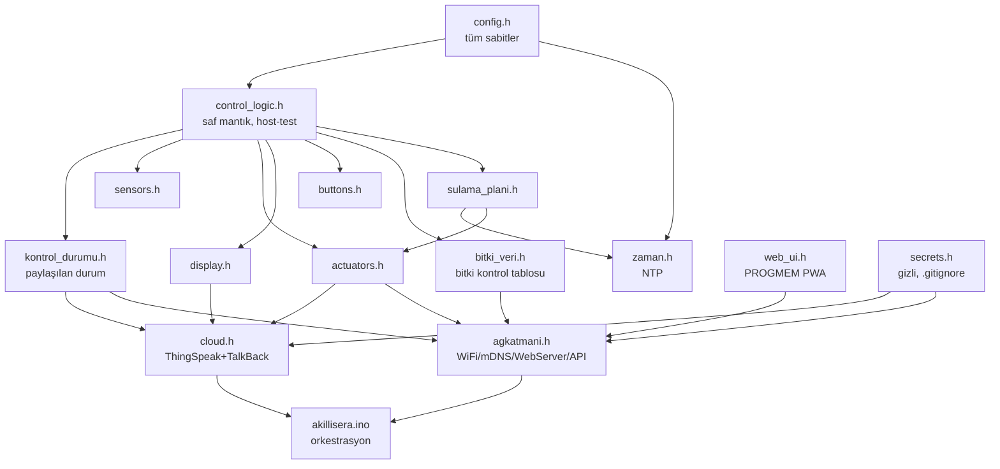

# 🌱 Akıllı Sera — ESP32 IoT İklim Kontrol İstasyonu

ESP32 tabanlı, sensörlerle iklimi izleyen ve pompa/fan/LED'i otonom süren bir akıllı sera firmware'i. Yerel web arayüzü (mobil), fiziksel butonlar, 16x2 LCD, ThingSpeak bulut kaydı ve TalkBack ile uzaktan komut destekler. Sulama/fan/LED kararları **seçilen bitki türüne** göre uyarlanır.

Wi-Fi kopsa bile sera **otonom** çalışmaya devam eder: sulama, fan, LED, alarm ve LCD ağdan bağımsızdır. Bulut yalnızca kayıt ve uzaktan komut için kullanılır.

> **Kapsam:** Bu depo yalnızca **firmware** (yazılım) içerir. Donanım montajı ayrı yürütülür; kod aşağıdaki pin sözleşmesine göre yazılmıştır.

---

## Donanım ve Pin Haritası

| Bileşen | Pin | Tip / Not |
|:---|:---|:---|
| Kapasitif toprak nem | GPIO34 | Analog giriş — **ADC1**, Wi-Fi ile uyumlu |
| DHT11 (sıcaklık/nem) | GPIO4 | Dijital, one-wire |
| LDR (ışık) | GPIO35 | Analog giriş — **ADC1** |
| LCD SDA / SCL | GPIO21 / GPIO22 | I2C, adres `0x27` |
| Röle Ch1 — su pompası | GPIO5 | Dijital çıkış, **AKTİF-LOW** |
| Röle Ch2 — tahliye fanı | GPIO18 | Dijital çıkış, **AKTİF-LOW** |
| Şerit LED (MOSFET gate) | GPIO25 | LEDC PWM, 5 kHz, 8 bit |
| Buzzer | GPIO19 | Dijital çıkış |
| Yeşil / Kırmızı LED | GPIO2 / GPIO15 | Dijital çıkış |
| Buton 1 (sulama) / Buton 2 (sayfa) | GPIO12 / GPIO14 | INPUT_PULLUP |

Kart: **NodeMCU-32S** (ESP32-WROOM-32). FQBN: `esp32:esp32:nodemcu-32s`.

### Detaylı Bağlantı (Wiring) Tablosu

Her bileşenin her ucunun ESP32 (veya güç/GND) ile eşleşmesi. Ortak GND şarttır: tüm modüllerin GND'si ve harici 12 V beslemenin GND'si ESP32 GND'siyle birleştirilir.

| Bileşen | Bileşen Ucu | Bağlanır | Not |
|:---|:---|:---|:---|
| **DHT11** (3-pin modül) | VCC (+) | ESP32 **3V3** | — |
| | DATA (OUT) | ESP32 **GPIO4** | Modülde dahili pull-up var; çıplak sensörde DATA–VCC arası 10 kΩ |
| | GND (−) | ESP32 **GND** | — |
| **Kapasitif Toprak Nem** | VCC | ESP32 **3V3** | — |
| | GND | ESP32 **GND** | — |
| | AOUT (analog) | ESP32 **GPIO34** | ADC1 — Wi-Fi ile uyumlu |
| **LDR Modülü** | VCC | ESP32 **3V3** | Çıplak LDR: bir uç 3V3, diğer uç GPIO35 **+** 10 kΩ→GND (gerilim bölücü) |
| | GND | ESP32 **GND** | — |
| | AO (analog) | ESP32 **GPIO35** | ADC1 |
| **16x2 LCD** (I2C/PCF8574) | VCC | **5V** (bazı modüller 3V3) | I2C hattı 3.3 V mantıkla uyumlu |
| | GND | ESP32 **GND** | — |
| | SDA | ESP32 **GPIO21** | — |
| | SCL | ESP32 **GPIO22** | Adres `0x27` (bazı modüller `0x3F`) |
| **2-Kanal Röle Modülü** | VCC | **5V** | — |
| | GND | ESP32 **GND** | — |
| | IN1 (su pompası) | ESP32 **GPIO5** | **Aktif-LOW** (LOW = röle çeker) |
| | IN2 (tahliye fanı) | ESP32 **GPIO18** | **Aktif-LOW** |
| | COM / NO | Pompa/Fan güç hattı | Röle kontağı yükü anahtarlar |
| **Şerit LED** (MOSFET ile) | MOSFET Gate | ESP32 **GPIO25** | 220 Ω seri; Gate–GND arası 10 kΩ pull-down önerilir |
| | MOSFET Drain | Şerit LED (−) | — |
| | MOSFET Source | ESP32 **GND** | — |
| | Şerit LED (+) | **+12V** (harici) | 12V GND ↔ ESP32 GND ortak |
| **Buzzer** (aktif) | + | ESP32 **GPIO19** | — |
| | − | ESP32 **GND** | — |
| **Yeşil LED** (durum) | Anot (+) | ESP32 **GPIO2** | 220 Ω seri direnç |
| | Katot (−) | ESP32 **GND** | — |
| **Kırmızı LED** (alarm) | Anot (+) | ESP32 **GPIO15** | 220 Ω seri direnç |
| | Katot (−) | ESP32 **GND** | — |
| **Buton 1** (sulama) | 1. bacak | ESP32 **GPIO12** | INPUT_PULLUP — harici direnç gerekmez |
| | 2. bacak | ESP32 **GND** | Basılınca pin LOW okur |
| **Buton 2** (sayfa) | 1. bacak | ESP32 **GPIO14** | INPUT_PULLUP |
| | 2. bacak | ESP32 **GND** | — |

**Güç hatları:** DHT11 / toprak nem / LDR → **3V3**. LCD / röle modülü → **5V**. Şerit LED → **harici 12V** (MOSFET ile anahtarlanır). **Yalnızca ADC1 pinleri** (GPIO32–39) Wi-Fi açıkken analog okunur — bu yüzden toprak nem GPIO34, LDR GPIO35.

---

## Mimari

Modüller katmanlı; alt katman üst katmanı tanımaz. Saf mantık (`control_logic.h`) hiçbir donanım/Arduino başlığına bağlı değildir — bilgisayarda birim testleriyle doğrulanır.



**Neden `.h` (dosya `.cpp` değil):** Arduino her `.cpp`'yi ayrı derleme birimi yapar; `inline` fonksiyonlu `.h`'lar tek derleme birimi (unity build) davranışını korur ve linker sorunlarını önler.

---

## Kurulum

**Gereksinimler:** [`arduino-cli`](https://arduino.github.io/arduino-cli/), `g++` (host testleri), `git`.

```bash
# ESP32 kart paketi
arduino-cli config init
arduino-cli config add board_manager.additional_urls https://espressif.github.io/arduino-esp32/package_esp32_index.json
arduino-cli core update-index
arduino-cli core install esp32:esp32

# Kütüphaneler
arduino-cli lib install "DHT sensor library"
arduino-cli lib install "Adafruit Unified Sensor"
arduino-cli lib install "LiquidCrystal I2C"
arduino-cli lib install "ArduinoJson"
```

**Sırlar:** `secrets.h.example`'ı kopyalayıp gerçek değerleri girin:
```bash
cp akillisera/secrets.h.example akillisera/secrets.h
# akillisera/secrets.h düzenle: WIFI_SSID, WIFI_PASSWORD, TS_WRITE_API_KEY,
# TS_CHANNEL_ID, TB_ID, TB_KEY   (secrets.h .gitignore'dadır, commit edilmez)
```

---

## Derleme, Yükleme, Test

```bash
# Derleme (huge_app partition — büyük app, OTA yok)
arduino-cli compile --fqbn esp32:esp32:nodemcu-32s \
  --build-property build.partitions=huge_app \
  --build-property upload.maximum_size=3145728 \
  --output-dir build --warnings all akillisera/

# Yükleme
arduino-cli upload -p /dev/cu.usbserial-0001 --fqbn esp32:esp32:nodemcu-32s akillisera/

# Seri monitör
arduino-cli monitor -p /dev/cu.usbserial-0001 -c baudrate=115200

# Host birim testleri (saf mantık — donanımsız)
g++ -std=c++17 -Wall -Wextra -Iakillisera tests/test_control_logic.cpp -o /tmp/tests && /tmp/tests
```

Kaynak kullanımı: **~%37 flash** (huge_app), **~%15 RAM**. Host testleri: **60+ test / 120+ assertion**.

---

## Erişim

ESP32 Wi-Fi'ye bağlanınca, **aynı ağdaki** telefon/PC'den:
- `http://akillisera.local` (mDNS) veya `http://<IP>` (IP LCD SISTEM sayfasında + seri monitörde görünür)

---

## Eşik Değerleri (`config.h`)

| Sabit | Değer | Anlam |
|:---|:---|:---|
| `SOIL_DRY_THRESHOLD` | 2200 | ham ADC üstünde toprak kuru |
| `LIGHT_LOW_THRESHOLD` | 1500 | altında karanlık → LED |
| `TEMP_HIGH_THRESHOLD` | 35.0 °C | üstünde alarm + fan |
| `HUM_HIGH_THRESHOLD` / `HUM_LOW_THRESHOLD` | 70 / 60 % | fan histerezisi |
| `WATERING_DURATION` | 5000 ms | pompa çalışma süresi |
| `WATERING_COOLDOWN` | 60000 ms | sulama güvenlik kilidi |
| `CLOUD_INTERVAL` / `TALKBACK_INTERVAL` | 30000 ms | API bütçesi (düşürme!) |

Bu değerler **varsayılan/custom**tır. Bir bitki seçilince kontrol, `bitki_veri.h`'daki o bitkiye özel eşikleri kullanır. `config.h`'daki `static_assert`'ler histerezis bandını, LED aralığını ve ThingSpeak günlük istek bütçesini derleme anında korur.

---

## Web API

| Yöntem | Yol | Gövde | Yanıt |
|:---|:---|:---|:---|
| GET | `/` | — | Mobil web arayüzü (HTML) |
| GET | `/api/durum` | — | Tüm sensör + eyleyici + mod + saat |
| GET | `/api/saglik` | — | uptime, boşHeap, enDüşükHeap, maxLoopMikro, RSSI, DHT hata |
| POST | `/api/sula` | — | Pompayı tetikler (60 sn kilit) |
| POST | `/api/fan` | `{"acik":bool}` | Manuel fan (fanı manuele alır) |
| POST | `/api/led` | `{"parlaklik":0-255}` | Manuel LED (geçersiz → 400) |
| POST | `/api/mod` | `{"fan"?,"led"?,"sulama"?:bool}` | Özellik başına oto/manuel |
| GET | `/api/plan` | — | Kullanıcı sulama planı |
| POST | `/api/plan` | `{"saat":0-23,"dakika":0-59}` | Sulama zamanı ekle |
| DELETE | `/api/plan` | `{"index":n}` | Sulama zamanı sil |
| GET / POST | `/api/bitki` | `{"bitki":"anahtar"}` | Bitki türü oku/ayarla |

Girdi doğrulama: geçersiz değer **400** (sessiz kırpma yok), gövde >512 B **413**, bilinmeyen uç nokta **404**.

---

## TalkBack Uzaktan Komutları

ThingSpeak TalkBack kuyruğuna bırakılan komutlar (30 sn'de bir çekilir):

| Komut | Etki |
|:---|:---|
| `SULA` | Pompayı tetikler (kilit devrede) |
| `FAN_AC` / `FAN_KAPA` | Fanı manuel aç/kapa |
| `OTO` | Fan + LED otomatik moda |
| `LED_<0-255>` | Şerit LED parlaklığı (örn. `LED_180`; kırpılır) |

Yanıt `\r\n` içerse bile kırpılır; geçersiz komut çökme üretmez.

---

## Bitki Türleri

Seçilen bitki hem **kontrolü** (sulama/fan/LED/alarm eşikleri, `bitki_veri.h`) hem **arayüz önerilerini** (ideal aralıklar + kombinasyon tavsiyeleri) belirler. Seçim NVS'te kalıcıdır.

Türler: Custom, Tomato, Lettuce, Pepper, Cucumber, Basil, Strawberry, Spinach. Her türün optimum sulama saatleri + ideal iklim aralıkları bahçecilik referanslarından derlenmiştir.

**Sulama modu:** *Oto* → bitkinin optimum saatleri + toprak eşiği. *Manuel* → kullanıcı planı + WATER butonu.

---

## Sorun Giderme

| Belirti | Olası neden / çözüm |
|:---|:---|
| `akillisera.local` açılmıyor | mDNS bazı Android'lerde çalışmaz → IP ile bağlan (LCD SISTEM sayfası) |
| LCD boş | I2C adresi `0x3F` olabilir → `config.h` `LCD_I2C_ADDR` değiştir |
| Açılışta pompa bir an çalışıyor | Röle aktif-LOW; `eyleyicileriBaslat` pinMode'dan önce RELAY_OFF yapar (düzeltilmiş) |
| ThingSpeak `0` dönüyor | Write key yanlış veya 15 sn kuralı; gövde kontrol edilir |
| DHT `NaN` / SENSOR HATASI | DHT11 2 sn'den sık okunmamalı; kablo/besleme kontrol |
| Şerit LED yanmıyor | ESP32 core 3.x LEDC → yalnızca `LED_PWM_*` makroları kullanılır |

---

## Bilinen Sınırlamalar

- **Kimlik doğrulama yok, HTTP (TLS değil):** yerel ağ kullanımı için. CORS `*` yalnızca geliştirme; üretimde kaldırılmalı.
- **ADC doğrusal değil:** mutlak doğruluk yok; yalnızca eşik karşılaştırması yapıldığından proje için yeterli.
- **mDNS** bazı Android sürümlerinde çözülmez → IP yedeği.
- **Bulut gönderimi senkron HTTP:** her 30 sn'de bir loop, HTTP zaman aşımına (≤5 sn) kadar duraklayabilir.
- **Fan aç/kapa** (röle); hız kontrolü PWM/donanım ister.

---

## Doğrulama Durumu

- ✅ Uyarısız derleniyor (`--warnings all`), ~%37 flash / ~%15 RAM
- ✅ Host birim testleri yeşil (saf kontrol mantığı: sulama, histerezis, debounce, komut ayrıştırma, zaman eşleşme, bitki eşikleri, LCD formatlama)
- ✅ QEMU'da boot + Serial doğrulandı (NVS/WiFi çevrebirimleri QEMU'da emüle edilmez)
- ✅ Web arayüzü mock-API ile tarayıcıda doğrulandı (canlı gösterge, kontroller, grafik, öneriler)
- ⏳ Uçtan-uca bulut + gerçek sensör testi fiziksel donanım gerektirir
